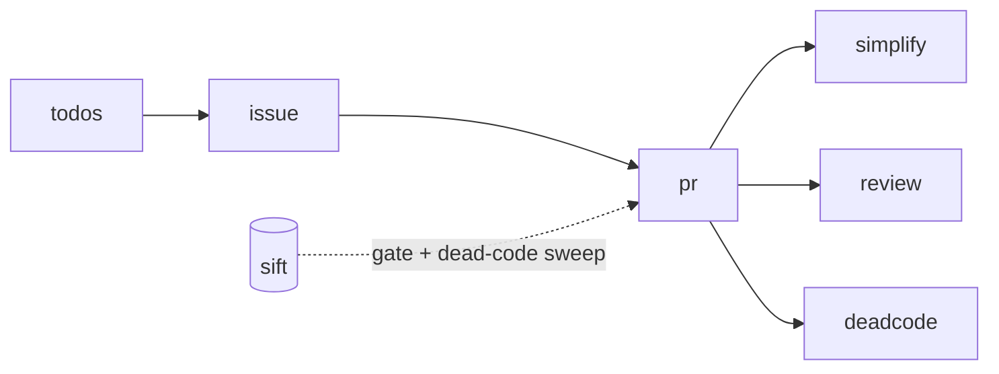

# skills

Agent skills I use daily, one per directory, each a self-contained `SKILL.md` plus any tooling.

| Skill | Use it to |
|---|---|
| [`todos`](#todos) | Decide what to do next across repos, and catch work that is rotting |
| [`issue`](#issue) | Turn an issue into a file-level plan — or a whole backlog into one PR |
| [`pr`](#pr) | Ship an approved change as a reviewed, green PR, on two models |
| [`simplify`](#simplify) | Shrink a finished diff without changing behaviour |
| [`review`](#review) | Review a diff for defects that execute, on a fixed budget |
| [`deadcode`](#deadcode) | Prove code dead before deleting it |
| [`autopsy`](#autopsy) | Account for every second and defect of one agent run |
| [`wow-forever-addon`](#wow-forever-addon) | Hold every WoW: Forever addon to one look, icon family, docs shape and CI baseline |
| [`wow-addon-publish`](#wow-addon-publish) | Publish a WoW addon to CurseForge and Wago, and cut releases |
| [`wow-mock-screenshots`](#wow-mock-screenshots) | Render WoW addon screenshots from the game's own art, without the client |



Each stands alone. They pair with **[sift](https://github.com/cjber/sift)**: `sift setup` records a
project's lint/type/test gate, which `/pr` runs; `sift audit diff` is `/pr`'s dead-code sweep.

## Install

```sh
npx skills add cjber/skills   # pick skills when prompted
npx skills add cjber/sift     # optional companion
```

Or copy the directories into `~/.claude/skills/`. Invoke by name (`/pr`) or describe the task.

**Needs:** Claude Code · [Codex CLI](https://github.com/openai/codex) (for `/pr`) · `gh` · `jq`
(watch scripts only) · signed commits.

**Adapt first:** the Codex model pin (`gpt-6-astra`), the `cb/<slug>` branch prefix and `gh stack`
are personal habits. Without sift, name your own gate in `/pr`.

---

## todos

A judgment layer over [beads](https://github.com/gastownhall/beads) (`bd`) for a durable, cross-repo
workload. Session todo lists vanish; this does not.

- File follow-ups **when found**, with the file and line that prove them.
- `/todos review` checks six leaks: uncaptured, stale, aging decisions, blocked on nothing, drift,
  unlinked.
- `/todos board` renders the graph as a standalone HTML page (`scripts/dashboard.py`).
- Finds its workspace from `$BEADS_WORKSPACE` or the nearest `.beads/`; track names come from your
  epics.

## issue

- `/issue 123 456` — plan only: reads the issue and the code, writes a file-level plan.
- `/issue` — triages the whole backlog, plans in parallel, builds **serially** onto one branch (one
  signed commit per issue), and opens one PR that closes them all.
- A red gate drops that issue back to plan-only; commits stage explicit paths, never `git add -A`.

## pr

Plan → isolate → implement → simplify + review → publish → drive green → merge (only when told).

- Every judgment phase runs on **two models** — a Claude arm and a Codex arm at high effort — which
  critique each other once. A second model does not share the first one's blind spots.
- Two arms only: no fan-out, no nested agents.
- Fix verified findings in the PR; filing an issue is not a resolution.
- Every review comment, bots included, gets a reply. Every push reopens that window.
- Never `gh pr update-branch` — it strips signatures.
- `scripts/watch_human.sh` tails the Codex arm for you; `scripts/watch_digest.sh` gives the agent a
  bounded digest with token usage.

## simplify

Makes a finished diff smaller, in order: delete → unify onto existing seams → use the library already
in the lockfile → collapse one-caller abstractions → trim tests and narrating comments.

- **Hard floor:** never weakens auth, tenancy, billing, persistence, concurrency or migrations to
  shrink a diff.
- Rejects "simpler" candidates that are longer or less typed.
- Long form: [`references/review-rubric.md`](simplify/references/review-rubric.md).

## review

One pass, a stated budget, defects that execute.

- Current model at medium effort; no parallel reviewers.
- One scoped second pass, only for security, billing, data loss, concurrency or migrations.
- Each finding: `file:line`, defect, failure scenario, smallest fix. "Nothing found" is a valid
  answer.

## deadcode

Scanners (`vulture`, `knip`, `ts-prune`, …) give candidates; this skill proves them.

- No reference ≠ dead: rule out dynamic dispatch, public API, ops/docs, string lookup and other
  services.
- Name-based scanners also **miss** dead islands that reference each other.
- Code referenced only by its test is dead; delete both.
- Analyse → prove → plan → **approval** → apply → verify. The approval gate is unconditional.
- Module reachability uses [`grimp`](https://github.com/seddonym/grimp) (Python); elsewhere use the
  nearest equivalent (`knip` for TS/JS). [sift](https://github.com/cjber/sift) wires scanners per
  language.

## autopsy

`/autopsy <run id | screenshot | text>` rebuilds one agent run's timeline from traces, events and
logs. Bare `/autopsy` samples the worst production runs and ranks defects by users affected.

- The time budget must add up; unaccounted time is a finding.
- No "flaky": every anomaly names its cause and the missing defence.
- `scripts/autopsy.py` runs mechanical detectors (retries after "stop", repeated calls, long gaps,
  cache misses, …) over a canonical JSONL your adapter emits. Trace locations go in
  `.claude/autopsy.md`, never the skill.
- Failure classes: [`references/taxonomy.md`](autopsy/references/taxonomy.md).

## wow-forever-addon

A standards pack: numbered requirements (`WFA-1`…) every WoW: Forever addon shares — retail-UI
look, one icon family, README and store-page budgets, CI and release baseline, repo settings and
the `main` ruleset. Each addon declares it under `## Standards` in its `AGENTS.md`, and
`sift audit` reviews against it.

- [`icon-template.svg`](wow-forever-addon/icon-template.svg) is the family frame; swap the emblem.
- `render_icon.py` renders `media/icon-400.png` and the 64 px `media/Icon.tga` from `media/icon.svg`.

## wow-addon-publish

Create the CurseForge and Wago projects through each site's own form in a logged-in browser, wire
their IDs into the TOC, and release with a signed tag that the BigWigs packager uploads everywhere.
Secrets and gallery deletions stay with the user.

## wow-mock-screenshots

`wowmock.py` fetches the pinned client build's atlases, textures, fonts and DB2 data from wago.tools
(cached, so reruns are byte-identical) and draws retail-UI widgets from Blizzard's own XML numbers.
Each addon keeps a small `tools/screenshots.py` for its scenes.

- Accuracy over polish: every scene is checked against a real capture before it ships.
- [`NOTES.md`](wow-mock-screenshots/NOTES.md) records what those checks found.
- Needs Python 3 and Pillow 12+.

## Licence

MIT. See [LICENSE](LICENSE).
